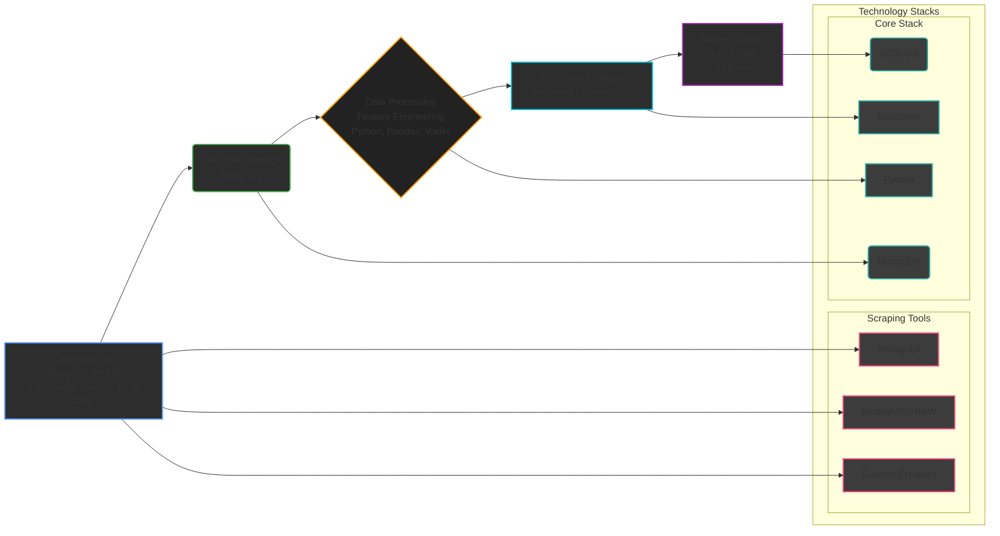

# Tourism Consultancy - SEA Tourism Volume Forecasting Engine

## Project Overview

This project implements a data-driven forecasting engine designed to predict monthly tourist arrivals for Southeast Asian (SEA) countries. It leverages a multivariate approach, integrating diverse data sources including social media trends, online review sentiment, economic indicators, and web search behavior to provide more accurate and actionable insights compared to traditional methods relying solely on historical data.

The goal is to equip the SEA Tourism Board and related stakeholders (governments, travel agencies, hospitality businesses, investors) with robust forecasts to optimize resource allocation, strategize marketing efforts, refine pricing, and mitigate risks associated with tourism demand fluctuations.

---

## Problem Statement

Traditional tourism volume forecasting methods, often limited to historical arrival data and seasonal trends, lack the granularity to account for dynamic, real-time factors. Economic shifts (exchange rates, GDP), evolving social media narratives, online review sentiment, and global events significantly impact travel decisions. This leads to inaccurate predictions, resulting in suboptimal infrastructure planning, inefficient marketing spend, and missed revenue opportunities across the SEA tourism ecosystem.

---

## Solution: Multivariate Predictive Model

We address this challenge by developing a predictive model that synthesizes data from multiple streams:

1.  **Economic Indicators:** Macroeconomic factors influencing travel affordability and propensity.
2.  **Social Media Signals:** Real-time pulse of public interest and sentiment towards SEA destinations captured from platforms like Instagram and Reddit.
3.  **Online Review Sentiment:** Aggregated opinions and experiences shared on platforms like TripAdvisor.
4.  **Web Search & Demand Data:** Indicators of active travel planning and interest captured via search engine trends and website traffic analysis.

By integrating these diverse features, the model aims to capture the complex interplay of factors driving tourism volume, leading to improved forecast accuracy.

---

## Technical Architecture & Stack



**Core Technologies Summary:**

*   **Scraping:** `Instagrapi`, `PRAW`, `requests`, `BeautifulSoup`/`Scrapy`
*   **Raw Storage:** `MongoDB`
*   **Processing:** `Python`, `Pandas`, `Vader`
*   **Feature Storage:** `Supabase` (`PostgreSQL`)
*   **Modeling:** `XGBoost`, `HyperOpt`, `Dmatrix`

---

## Data Pipeline & Methodology

1.  **Data Acquisition:** Scheduled scripts run periodically to scrape data from Instagram, Reddit, TripAdvisor, and Google (or other economic data sources). Raw data (posts, comments, reviews, economic figures, search trends) is collected.
2.  **Raw Data Ingestion:** Scraped data is pushed into MongoDB collections, preserving the original structure as much as possible. Each source might have its own collection (e.g., `instagram_posts`, `reddit_comments`, `tripadvisor_reviews`, `economic_indicators`).
3.  **Data Cleaning & Preprocessing:** Python scripts retrieve data from MongoDB. Tasks include:
    *   Text cleaning (removing URLs, special characters, normalization).
    *   Date/Time parsing and standardization.
    *   Handling missing values (imputation or removal based on strategy).
    *   Type conversion.
4.  **Feature Engineering:** Key features are extracted and calculated:
    *   **Social Media Metrics:** Aggregating counts (mentions, likes, comments) per country/destination per month.
    *   **Sentiment Analysis:** Applying Vader to text data (captions, comments, reviews) to generate sentiment scores (e.g., compound score).
    *   **Weighted Sentiment:** Calculating engagement-weighted sentiment scores (e.g., `sentiment_score * log(likes + comments + 1)`).
    *   **Economic Data:** Aligning economic indicators (Exchange Rate, GDP, Inflation) to monthly frequency, potentially involving interpolation or forward/backward filling.
    *   **Demand Indicators:** Processing Google Search Volume data and website traffic metrics, aggregating monthly.
    *   **Temporal Aggregation:** Grouping all data by `(country, year, month)`.
5.  **Structured Data Loading:** The processed, aggregated, and feature-engineered data is loaded into Supabase (PostgreSQL) tables. This structured format facilitates efficient querying for model training. The schema likely includes columns for each feature and the target variable, indexed by country and month.
6.  **Model Training:**
    *   Data is queried from Supabase for the relevant time period and countries.
    *   Features (X-Variables) and the Target Output (Y-Pred) are prepared.
    *   An XGBoost Regressor model is trained on the historical feature set to predict `visitors_per_month`.
    *   Hyperparameter tuning (e.g., using GridSearchCV or RandomizedSearchCV) is performed to optimize model performance.
    *   Model evaluation uses appropriate metrics for forecasting (e.g., RMSE, MAE, MAPE).
7.  **Prediction:** The trained XGBoost model is saved. It can then be loaded to predict future monthly visitor numbers based on the latest available feature data ingested through the pipeline.

## Repository Structure
```bash
├── backend/                  # Core prediction engine
│   ├── configs/              # Configuration files
│   ├── data/                 # Data storage directory
│   │   ├── processed/        # Transformed data
│   │   └── raw/              # Raw scraped data
│   ├── env/                  # Python environment
│   ├── notebooks/            # Jupyter notebooks for exploration
│   ├── src/                  # Source code
│   │   ├── data_pipeline.py  # Main ETL orchestration
│   │   ├── currency/         # Currency conversion utilities
│   │   ├── google_trends/    # Google search data collection
│   │   ├── instagram/        # Instagram scraping modules
│   │   ├── model/            # ML modeling components
│   │   ├── mongodb/          # MongoDB connection and queries
│   │   ├── reddit/           # Reddit data collection
│   │   ├── sentiment_analyzer/# NLP sentiment analysis
│   │   ├── services/         # Utility services
│   │   ├── supabase/         # Supabase DB operations
│   │   ├── tiktok/           # TikTok data collection (future)
│   │   └── tripadvisor/      # TripAdvisor scraping modules
│   └── trained_models/       # Country-specific models
├── frontend/                 # Visualization interface
└── .env                      # Environment variables
```